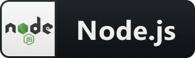

Hey! Welcome to my profile! How is it going?  
🚀 I’m currently working at UnixTech  
💻 Node, ReactJS, React Native, Typescript  

     
  
    
    
    
    
    
    
    
    
    
    
    
    
    

